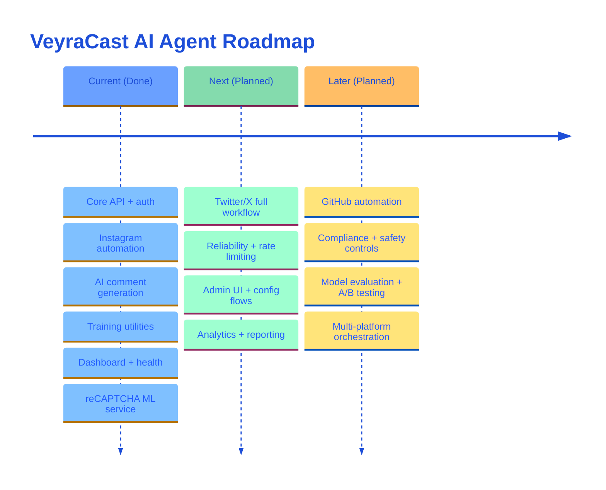
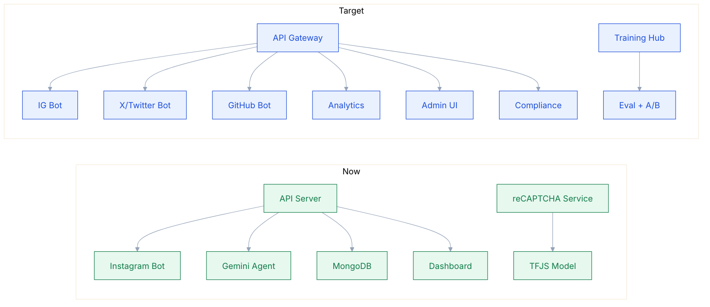

# VeyraCast AI Agent Roadmap

This roadmap is based on the current codebase state and is meant to guide ongoing development. Items marked as completed are already implemented in the repository.

## Status Legend

Done
In progress
Planned
Blocked

## Summary

- Current state: Instagram automation, AI content generation, training utilities, API server, dashboard, and reCAPTCHA ML subproject are present.
- Near term: Stabilize automation, finish Twitter/X pipeline, improve safety/rate limits, and harden ops.
- Long term: Multi‑platform expansion, richer training, analytics, and compliance tooling.

## Milestones

- [x] Core API server, auth, and health endpoints
- [x] Instagram automation (login, interact loop, posting, scheduling)
- [x] AI comment generation with Gemini + schema
- [x] Training utilities (YouTube, file parsing, website scraping)
- [x] Simple dashboard for health + last run
- [x] reCAPTCHA ML service (train/serve/admin UI)
- [ ] Twitter/X full workflow (compose, schedule, media, metrics) — **partial** (API routes + media upload on main)
- [ ] GitHub automation (planned)
- [ ] Analytics and reporting (cross‑platform)
- [ ] Production hardening and compliance features

## Phased Delivery

| Phase   | Goals                                                                       | Status                                                                                                                                                              |
| ------- | --------------------------------------------------------------------------- | ------------------------------------------------------------------------------------------------------------------------------------------------------------------- |
| Phase 1 | Twitter/X MVP, IG reliability pass, admin UI basics                         | Mostly done |
| Phase 2 | Analytics, observability, policy/rules engine, compliance guardrails        | Planned     |
| Phase 3 | Multi‑platform orchestration, model evaluation + A/B, scale & cost controls | Planned     |

## Workstreams and Checklist

### 1) Platform Automation

- [x] Instagram browser automation (Puppeteer + stealth)
- [x] Instagram post by URL and file
- [x] Instagram scheduling (cron)
- [x] Instagram follower scraping
- [x] Cookie persistence and relogin handling
- [ ] Instagram reliability pass: captcha/challenge escalation workflow — **partial** (detect + cooldown + webhooks + dynamic profile downgrade)
- [ ] Instagram action throttling by risk profile (dynamic) — **partial** (`getEffectiveIgProfile` downgrades after challenges)
- [ ] Twitter/X end‑to‑end publish pipeline — **partial** (text + media API)
- [x] Twitter/X scheduling and media upload
- [x] Twitter/X engagement actions (like/retweet/reply)
- [ ] GitHub automation: issues, PRs, releases

### 2) AI and Training

- [x] Gemini JSON‑schema generation for comments
- [x] API key rotation on rate limit
- [x] YouTube transcript ingestion
- [x] Audio and file‑based training ingestion
- [x] Website scraping for training data
- [ ] Prompt evaluation harness with golden datasets
- [ ] Multi‑persona training and selection
- [ ] Safety filters for toxic content and brand rules
- [ ] Model/agent selection and A/B testing

### 3) Data and Storage

- [x] MongoDB connection and models (legacy; app uses PostgreSQL for action logs)
- [x] Tweet schema for rate limiting
- [ ] Unified action log (IG/Twitter/GitHub) — **partial** (IG + Twitter logged; GitHub pending)
- [ ] Content cache + dedupe layer
- [ ] Audit trail for moderation and compliance

### 4) API and Dashboard

- [x] REST API (login, interact, post, schedule)
- [x] /dashboard summary UI
- [x] Health endpoint
- [ ] Web UI for configuring accounts and profiles — **partial** (`GET /api/accounts` + dashboard config panel)
- [x] Admin panel for viewing actions, logs, and errors
- [x] Webhook endpoints for external triggers
- [x] API rate limiting and API keys for third‑party usage — **partial** (rate limits done; third-party API keys pending)

### 5) Ops, Security, Reliability

- [x] Env validation scripts
- [x] Logging with Winston
- [x] Docker‑based MongoDB setup docs
- [ ] Secrets management for production (vault/parameter store)
- [ ] Observability: metrics + alerts — **partial** (metrics dashboard; alerts pending)
- [ ] CI coverage for integration tests
- [ ] Chaos testing for IG loops
- [ ] Legal/compliance guardrails and TOS risk toggles
- [ ] Action audit logs and tamper‑evident storage
- [ ] Automated rollback on error spikes
- [ ] Rate‑limit aware backoff across providers

### 6) reCAPTCHA ML Subproject

- [x] Model architecture and training flow
- [x] Admin UI and debug views
- [x] Training data collection pipeline
- [x] Model serving endpoints
- [ ] Dataset versioning and quality checks
- [ ] Model performance tracking and drift detection
- [ ] Active learning loop for hard examples
- [ ] Eval harness with fixed validation sets

## Timeline (High‑Level)

## Architecture Coverage (Now vs Target)

## Delivery Criteria (Release Gates)

| Gate          | Criteria                                         | Status                                                                                                                                                          |
| ------------- | ------------------------------------------------ | --------------------------------------------------------------------------------------------------------------------------------------------------------------- |
| Reliability   | 7‑day crash‑free IG loop, < 3% challenge rate    | Planned |
| Security      | Secrets not stored in repo, JWT/session hardened | Planned |
| Quality       | Integration tests for login/post/cron            | Planned |
| Observability | Metrics + alerts for errors and cooldowns        | Planned |

## KPI Targets (Suggested)

| Area        | KPI                             | Baseline | Target | Notes                             |
| ----------- | ------------------------------- | -------- | ------ | --------------------------------- |
| Instagram   | Successful interactions per run | TBD      | +30%   | Based on stable login + cooldowns |
| Instagram   | Challenge rate                  | TBD      | < 3%   | Requires risk‑based throttling    |
| AI Output   | Avg comment engagement          | TBD      | +25%   | Needs analytics + tracking        |
| Reliability | Crash‑free loop runs            | TBD      | 99%    | Add watchdog + retries            |
| ML Model    | reCAPTCHA accuracy              | TBD      | > 92%  | Track via validation set          |

## Risks and Mitigations

| Risk                 | Impact | Mitigation                                           | Status                                                                                                                                                              |
| -------------------- | ------ | ---------------------------------------------------- | ------------------------------------------------------------------------------------------------------------------------------------------------------------------- |
| IG challenges / bans | High   | Dynamic throttling, cooldowns, better fingerprinting | In progress |
| Provider rate limits | Medium | Key rotation, backoff, queueing                      | Done        |
| Data quality drift   | Medium | Validation sets, drift monitoring                    | Planned     |
| Compliance exposure  | High   | Policy rules, opt‑out, audit logs                    | Planned     |

## Dependencies

- Stable access to IG and X/Twitter APIs or browser‑automation compatibility.
- Gemini API key availability and quota.
- MongoDB availability for persistence and logging.
- Proxy infrastructure if scaling across multiple accounts.

## Quality and Testing Strategy

- Unit tests for utilities and schema constraints.
- Integration tests for login, posting, scheduling, and cooldown behavior.
- Load tests for API endpoints and training pipelines.
- Regression suite for prompt outputs and content safety filters.

## Backlog (Unscheduled)

- [ ] Mobile‑friendly dashboard
- [ ] Multi‑account policy/rules engine
- [ ] Task queue (BullMQ/Redis)
- [ ] Content calendar and approvals
- [ ] Per‑account proxy assignment
- [ ] Pluggable model providers (OpenAI, local)
- [ ] Data retention and deletion policies
- [ ] Webhook‑based partner integrations
